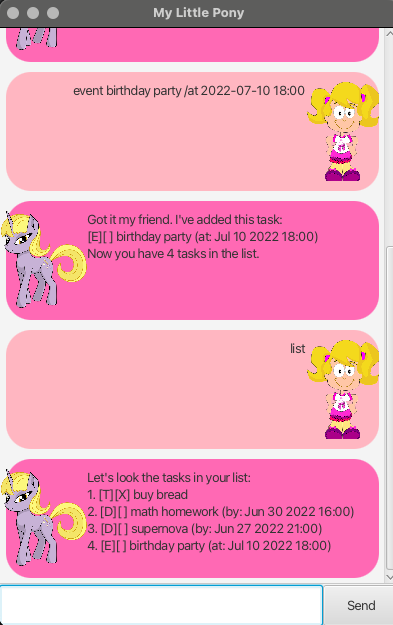

# User Guide

Duke is a desktop app for managing tasks, optimized for use via a Command Line Interface (CLI)
while still having the benefits of a Graphical User Interface (GUI). Duke provides flexibility by
allowing the tracking of various types of tasks including events and deadlines.

- [Quick start](https://ciaoosuuu.github.io/ip/#quick-start)
- [Features](https://ciaoosuuu.github.io/ip/#features)
- [Usage](https://ciaoosuuu.github.io/ip/#usage)
    - [Adding a todo: `todo`](https://ciaoosuuu.github.io/ip/#adding-a-todo-todo)
    - [Adding a deadline: `deadline`](https://ciaoosuuu.github.io/ip/#adding-a-deadline-deadline)
    - [Adding a event: `event`](https://ciaoosuuu.github.io/ip/#adding-a-event-event)
    - [Listing all tasks: `list`](https://ciaoosuuu.github.io/ip/#listing-all-tasks-list)
    - [Deleting a task: `delete`](https://ciaoosuuu.github.io/ip/#deleting-a-task-delete)
    - [Finding specific tasks: `find`](https://ciaoosuuu.github.io/ip/#finding-specific-tasks-find)
    - [Marking a task: `mark`](https://ciaoosuuu.github.io/ip/#marking-a-task-mark)
    - [Unmarking a task: `unmark`](https://ciaoosuuu.github.io/ip/#unmarking-a-task-unmark)
    - [Exiting the program: `bye`](https://ciaoosuuu.github.io/ip/#exiting-the-program-bye)
- [Commmand summary](https://ciaoosuuu.github.io/ip/#command-summary)

## Quick Start

1. Ensure you have Java `11` or above installed in your Computer.
2. Download the latest `Pony.jar` file from [here](https://github.com/ciaoosuuu/ip/releases/tag/Pony).
3. Locate the file and double-click the file to start the app.



5. Type the command in the command box and press Send to execute it.

6. Refer to the [Features](https://ciaoosuu.github.io/ip/#features) below for details of each command.


## Features

### Task management
Add tasks by indicating type of task to add or delete tasks by indicating index of task to delete.

### Track task status
Mark or unmark task to track completed and incomplete tasks.

### View tasks
Display all tasks in a list or filter tasks using a keyword.

## Usage
### Adding a task
You can add either a todo, event (occurs on a specified date) or deadline (due by a specified date) as tasks.

#### Adding a todo: `todo`
Adds a todo.

Format: `todo TASK_DESCRIPTION`

Examples:
- `todo CS2103T tutorial`
- `todo watch movie`

Expected outcome:

Todo added to task list when valid description given.

```
Got it. I've added this task:
[T][ ] TASK_DESCRIPTION
Now you have X tasks in the list.
```

#### Adding a deadline: `deadline`
Adds a deadline.

Format: `deadline TASK_DESCRIPTION /by YYYY-MM-DD`

Examples:

- `deadline return book /by 2022-09-20`
- `deadline submit CS2102 assignment /by 2022-09-17`

Expected outcome:

Deadline added to task list when valid description and date given.

```
Got it. I've added this task:
[D][ ] TASK_DESCRIPTION (by: MMM DD YYYY)
Now you have X tasks in the list.
```
#### Adding an event: `event`
Adds an event.

Format: `event TASK_DESCRIPTION /at YYYY-MM-DD`

Examples:

- `event NUS internship day /at 2022-10-30`
- `event NUS Supernova /at 2022-09-22`

Expected outcome:

Event added to task list when valid description and date given.

```
Got it. I've added this task:
[E][ ] TASK_DESCRIPTION (at: MMM DD YYYY)
Now you have X tasks in the list.
```

### Listing all tasks: `list`
Displays a list of tasks added.

Format: `list`

Expected outcome:

```
Here are the tasks in your list:
1. ...
2. ...
```

### Deleting a task: `delete`
Deletes the task from task list.

Format: `delete INDEX`
- Deletes the task at the specified `INDEX`.
- `INDEX` refers to the index number shown after using `list`.

Examples:

- `delete 1` deletes the 1st task in `list` if it exists.

Expected outcome:

Deletes a task when valid index is given.

```
Noted. I've removed this task:
[X][ ] TASK_DESCRIPTION
Now you have X tasks in the list.
```

### Finding specific tasks: `find`
Display tasks where the description matches given keywords.

Format: `find KEYWORD`
- Search is case-sensitive. e.g. `homework` will not match with `Homework`
- Partial keywords can be used as well. e.g. `work` will match with `homework`

Examples:
- `find homework` returns a list of all tasks with description containing the keyword `homework`
- `find NUS concert` returns a list of all tasks with description containing the keyword `NUS concert`

Expected outcome:

```
Here are the matching tasks in your list:
1. ...
2. ...
```

### Marking a task: `mark`
Marks a task as completed.

Format: `mark INDEX`
- Marks the task at the specified `INDEX` as completed.
- `INDEX` refers to the index number shown after using `list`.

Examples:
- `mark 1` marks the first task in `list` if it exists.

Expected outcome:

Marks a task as completed when valid index is given.

```
Nice! I've marked this task as done:
[X][X] TASK_DESCRIPTION
```

### Unmarking a task: `unmark`
Marks a task as incomplete.

Format: `unmark INDEX`
- Marks the task at the specified `INDEX` as incomplete.
- `INDEX` refers to the index number shown after using `list`.

Examples:
- `unmark 1` marks the first task in `list` as incomplete if it exists.

Expected outcome:

Marks a task as incomplete when valid index is given.

```
OK, I've marked this task as not done yet:
[X][ ] TASK_DESCRIPTION
```

### Exiting the program: `bye`
Exits the program.

Format: `bye`

Expected outcome:

Prints goodbye message and exits the program.

```
Bye. Hope to see you again soon!
```


## Command summary

**Action** | **Format, Examples**
--- | ---
todo | `todo TASK_DESCRIPTION` <br> e.g. `todo watch movie`
deadline | `deadline TASK_DESCRIPTION /by YYYY-MM-DD` <br> e.g. `deadline CS2101 Assignment /by 2022-09-15`
event | `event TASK_DESCRIPTION /at YYYY-MM-DD` <br> e.g. `event NUS Supernova /at 2022-09-01`
list | `list`
delete | `delete INDEX` <br> e.g. `delete 1`
find | `find KEYWORD` <br> e.g. `find test`
mark | `mark INDEX` <br> e.g. `mark 3`
unmark | `unmark INDEX` <br> e.g. `unmark 2`
bye | `bye`